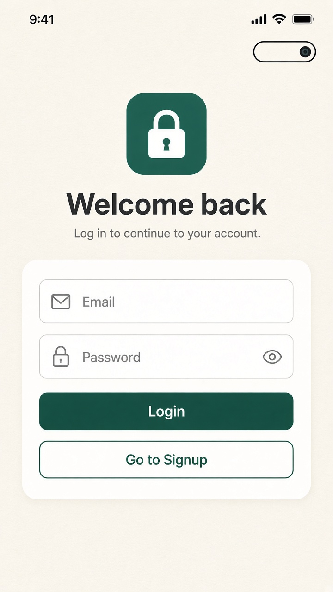
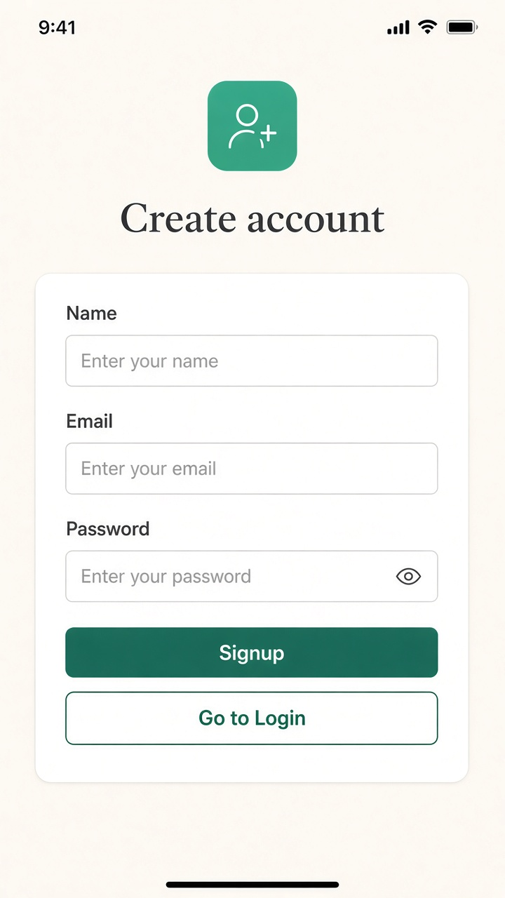
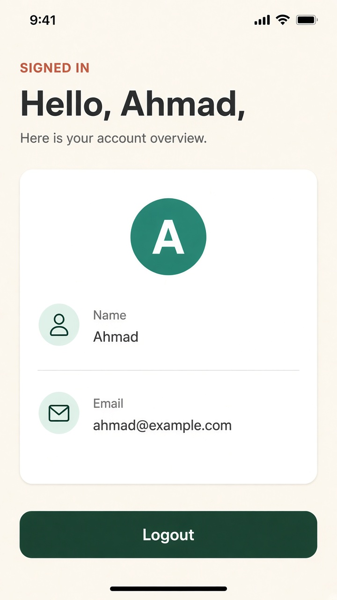
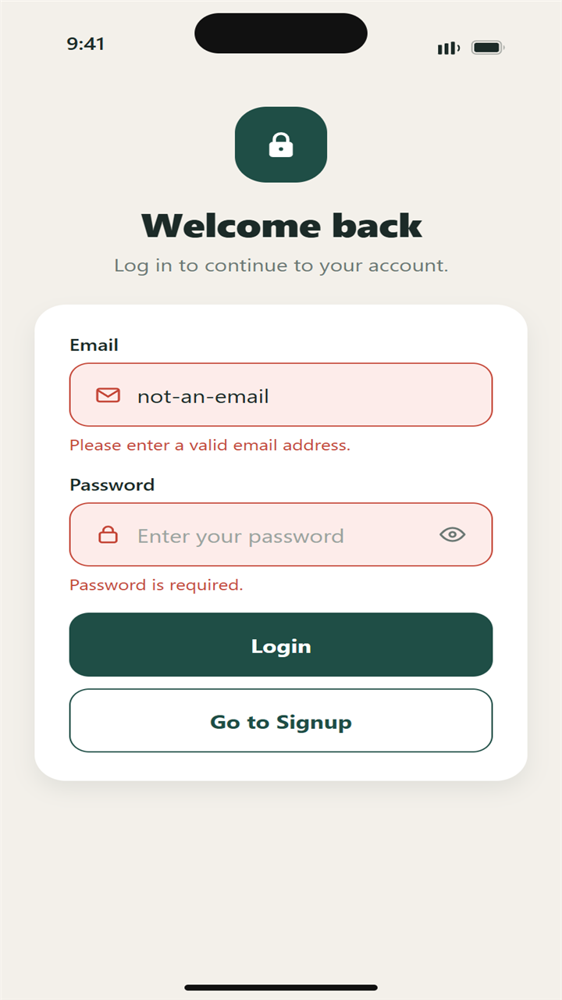
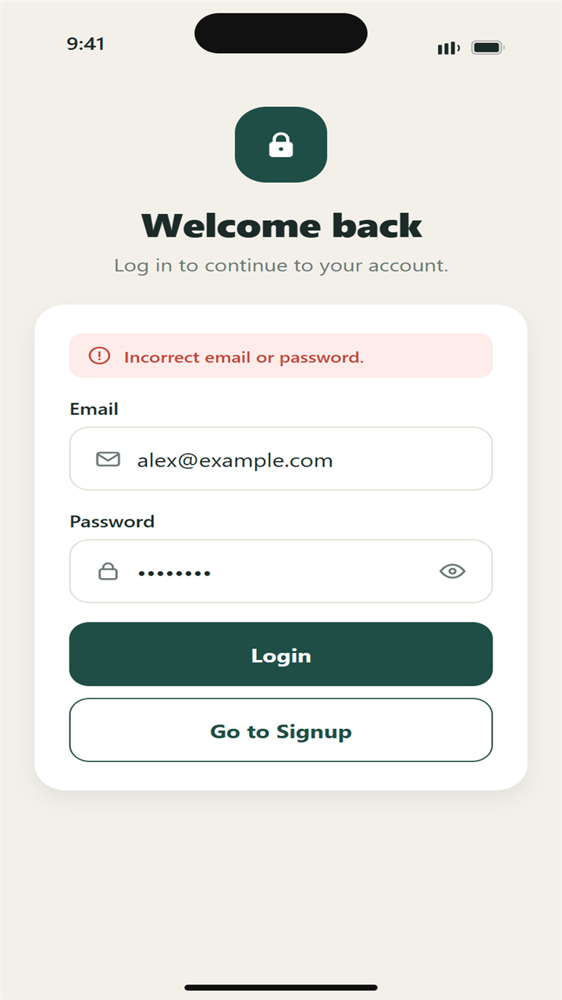
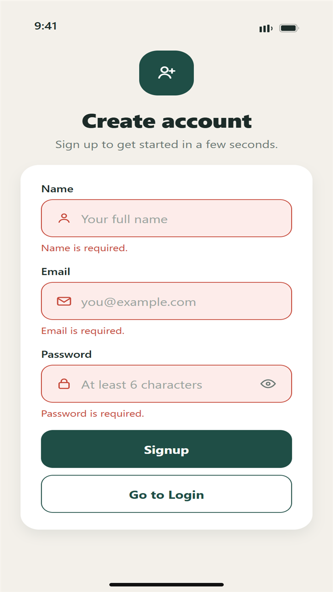
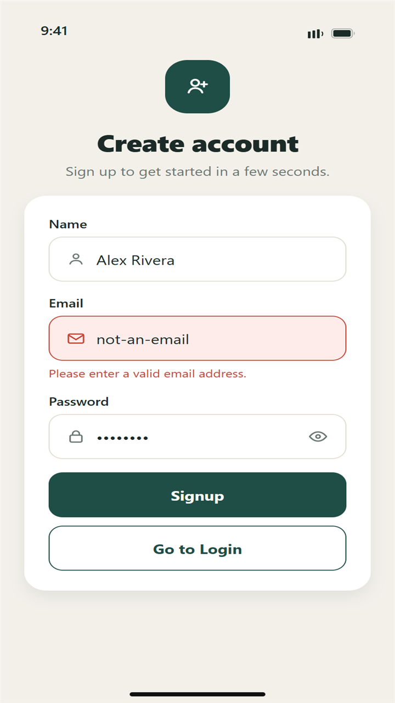
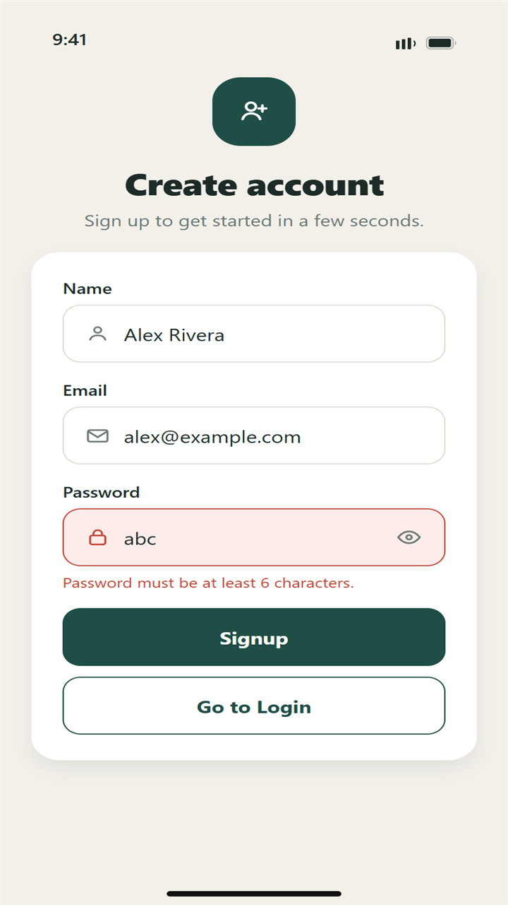

# React Native User Authentication App

Expo React Native app with login, signup, and a simple home screen. Auth state is handled with React Context API, navigation with React Navigation, and the session is saved with AsyncStorage so it survives app restarts.

## Features

- Login and signup forms with validation
- Global auth state (`user`, `login`, `signup`, `logout`) via Context API
- Home screen showing the signed-in user's name and email
- Session persistence with AsyncStorage
- Password show/hide toggle

## Setup

```bash
cd user-auth-app
npm install
npx expo start
```

Then open the app in Expo Go, or press `a` / `i` for an emulator.

## Usage

1. Create an account on Signup (password must be at least 6 characters).
2. You'll land on Home with your name and email.
3. Logout returns you to Login.
4. Closing and reopening the app keeps you signed in if a session exists.

Accounts are stored locally on the device (no backend).

## Project structure

```text
src/
  context/AuthContext.js
  navigation/AppNavigator.js
  screens/
  components/
  utils/validation.js
  constants/theme.js
App.js
```

## Screenshots


















